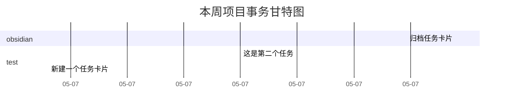

## TODO
- [ ] 多喝水，避免久坐不动
- [ ] 阅读一篇文献

## Tracking

据说任务看板的归档甘特图生成有些问题，这里测试一下。

```mermaid
gantt
title 本周项目事务甘特图
dateFormat YYYY-MM-DD HH:mm:ss
axisFormat %m-%d
section obsidian
归档任务卡片 :t1, 2022-05-07 12:27:44, 1min
section test
这是第二个任务 :t2, 2022-05-07 12:27:25, 1min
新建一个任务卡片 :t3, 2022-05-07 12:27:08, 1min 
```

没有复现问题，估计是不同环境存在 terminal 跟 terminator 插件交互的问题，干脆再增加一个把文本内容复制到粘贴板的动作，如果不显示，可以直接粘贴。
