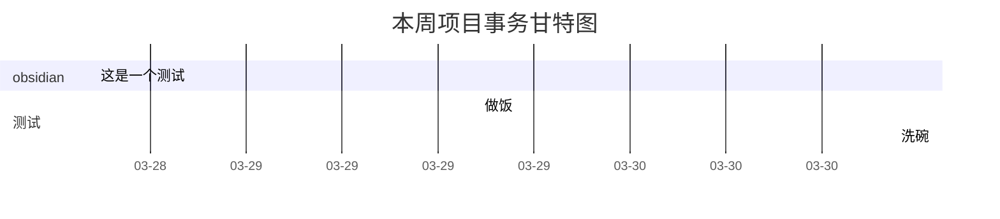

```ad-info
title: 友情提示
这部分内容很多前面已经提过，所以主要是增加对制作任务甘特图的说明。
```

### 在幻灯片中总结工作

虽然文献阅读周小结我建议单独新建页面进行撰写（详见[[阶段性文献阅读小结]]），但是工作小结方面的内容还是推荐并入[[每周定期汇总小结]]中。

由于周小结往往需要进行幻灯片展示给他人，所以可以从周小结页面通过双链再新建一个幻灯片页面来进一步汇总整理本周完成的课题相关的事务。如何制作 obsidian 的幻灯片其实也在第一章就介绍过了（详见[[在obsidian中写幻灯片]]）。


### 从看板的归档任务创建甘特图

你可以在周小结页面，通过 `quickAdd: 🐸任务存档` 来一键完成本周项目任务的看板流程。

它会根据[[任务看板]]中已经归档的内容（参考[[新建课题项目#利用看板管理任务]]），生成一个甘特图，从而直观显示本周你在课题项目中的事务进展。示例如下方。



你当然可以把这段甘特图代码拷贝到工作汇报的obsidian幻灯片中，它在幻灯片中也是能够正常显示的。

注意此命令并不会帮你删除看板中已归档的内容。因此会逐渐累积过去所有已归档的内容制作甘特图。如果你只想显示一周内的。你可以定期每周制作完甘特图之后，删除已归档卡片内容。

### 归档记录并查看概览

前面我们已经再三提醒，草稿的 front-matter 部分的 destination 相对路径信息要填写正确。这样才可以对所有 `01-Diary/本周事务` 中的草稿使用`QuickAdd: 📒草稿归档` 命令以自动归档。

![[Pasted image 20220329092656.png]]

正确归档后，你可以按住 Ctrl，click该项目的子文件夹查看其overview（参考[[新建课题项目#项目概览]]），如上图所示，你可以很直观地以卡片的方式（卡片会抓取笔记中图片和文字作为内容摘要）查看每一次的实验记录。

```ad-info
title: 下节预告
关键性的实验结果拿到以后，一般这个课题就可以开始动手撰写论文草稿了。
```

---

page:: 22