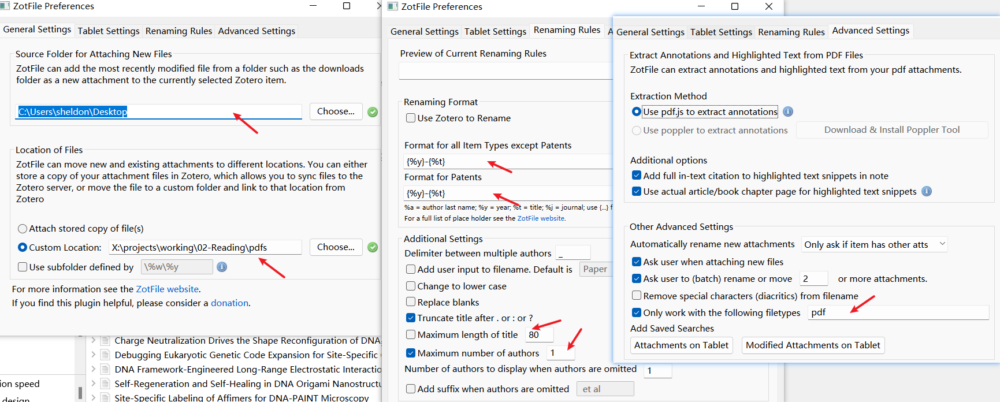
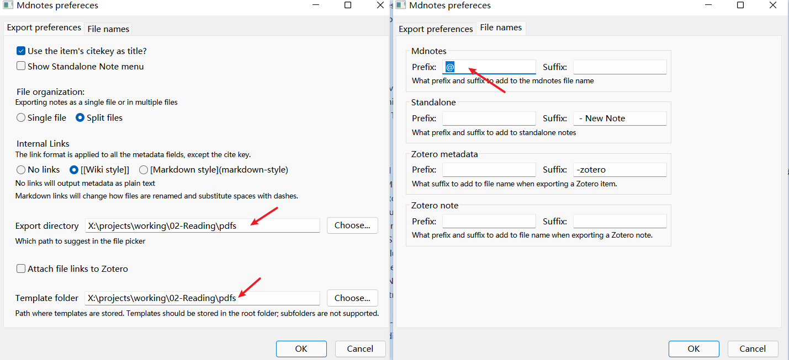
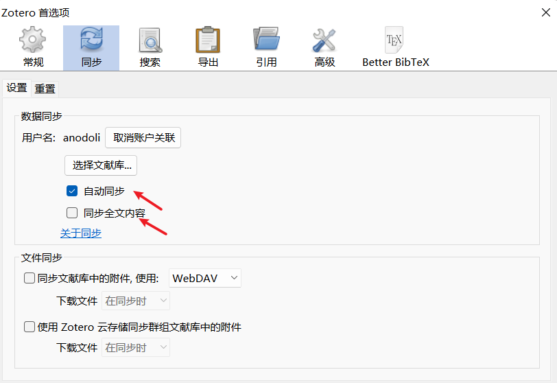
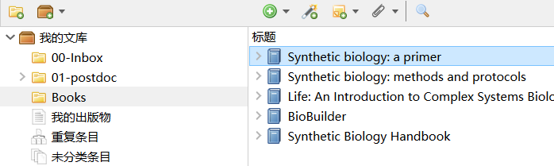
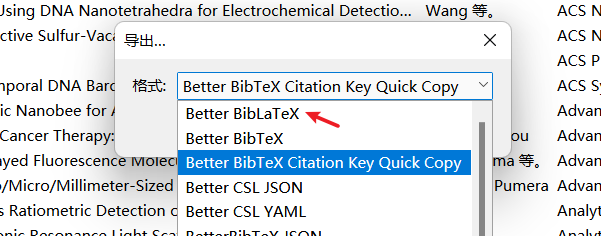
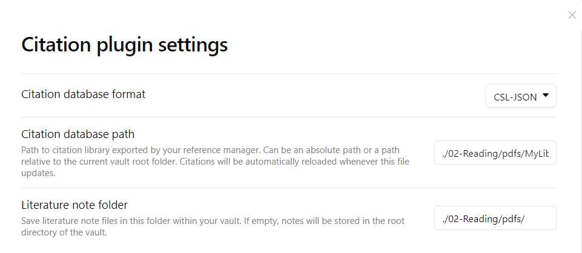

# obsidian_vault_template_for_researcher

从接触到使用 obsidian 已经有一段时间了，感觉这个工具用好了应该对搞科研有较大帮助。

## 安装部署

下载安装软件：目前 obsidian 是开源免费的跨平台软件，可以直接到[官网](https://obsidian.md/download)下载安装包。

### 下载模板vault

1. 综合网上各种建议，和结合自己`阅读文献`和`写日志`的需求，此模板vault包含以下几个子文件夹：
	- 00-Inbox：临时性内容
	- 01-Diary：存放模板化的日志
	- 02-Reading：存放文献库和文献阅读笔记
	- 03-Projects：按各种实际的项目分类存储相关笔记
	- 08-Assets：存放附件，包括插图、视频、以及各种其它文件
	- 09-Templates： 存放笔记模板
	> 注意子文件夹数目不要超过 10 个，否则会比较混乱。
2. 下载了vault模板之后，解压到一个指定位置，可以是电脑上的硬盘，也可以是移动硬盘甚至U盘，然后重命名vault。比如我把 vault 命名为 working，然后放到了移动硬盘的 projects 目录下：`X:\projects\working`。

### 安装zotero和相关插件

- [Zotero](https://www.zotero.org/)：文献管理工具，有浏览器插件，支持直接拖拽pdf或者输入doi等方式快捷导入条目
- [Zotfile](https://github.com/jlegewie/zotfile/releases)：自动 rename 附件，然后复制到制定目录，还能从 pdf 中提取高亮注释
- [Mdnotes](https://github.com/argenos/zotero-mdnotes/releases/tag/0.1.3)：将文献记录按照模板生成 markdown 笔记
- [Better Bibtex](https://github.com/retorquere/zotero-better-bibtex/releases/tag/v5.5.4)：生成 citation key，导出为更好的 bibtex 记录，也可以是 json，配合 obsidian 的 citations 插件使用。

> 注意先安装插件，弄好设置之后，再登录zotero账户同步。


### zotero设置


如上图所示注意保持一致，注意zotero附件**根目录设置为 vault 下的 `\02-Reading\pdf`，并选择使用相对路径**。另外先不要注册账户并登录同步，等到插件设置好了再说！

### zotfile插件设置

zotfile 是 zotero 中最强大的插件，注意**将 pdf下载的临时目录设置为桌面**，以后每次从网上下载 pdf 到桌面，该插件可以半自动把 pdf 重命名并转移到**指定目录**（`\02-Reading\pdf`)去，然后创建相对链接。

### mdnotes插件设置

同上，注意一些路径的设定修改。

### Better_Bibtex插件设置

注意修改 citation key 的格式，如上图所示。

### 注册zotero账户并登录

可以使用 zotero 同步自己的文献条目，但是尤其要注意不要同步全文内容（pdf），不然 zotero 提供的 200 M 空间是远远不够的。新用户注册[点此进入](https://www.zotero.org/user/register)。

### Zotero文献库目录设计

目录结构非常重要，建议现有一个缓冲区`00-Inbox`，作为主题分类不清晰的文献的暂存目录，快速扫读之后再拖拽分类到其它目录中。

### 向Zotero中导入文献

推荐输入 DOI 的方式插入文献条目，这种方式抓取到的信息是最完整准确的。

### 导出整个文献库到vault

先导出为 JSON 文件，导出到 **指定目录**（`\02-Reading\pdf`）去，注意文件名修改为英文`MyLibrary`；然后再导出为 Better BibLaTeX（如下图所示)，同样修改为英文名，导出到同上目录。



### 设置obsidian-citations插件

然后设置 citation 插件，注意修改一些路径，如上图所示。


### 安装python和依赖项

一些自定义功能依赖于 python 脚本代码实现，建议安装 anaconda （清华TUNA镜像源）并将其添加到环境变量（安装时全打勾）。

使用cmd命令行工具安装以下 python 模块：

```bash
pip install pyperclip bibtexparser
```


## 写日记

1. 按快捷键`Ctrl+Q`，打开 QuickAdd 命令面板，选择`💎timeStamp`进行当天的日志记录，如[[2021-10-30]]。
2. 按快捷键`Ctrl+Q`，打开 QuickAdd 命令面板，选择`⚡newTask`，可以快速添加一个新的代办事项到[[任务看板]]。
3. 按快捷键`Ctrl+Q`，打开 QuickAdd 命令面板，选择`📊weekNote`，可以快速创建周小结，自动提取日志记录关键内容。

**强烈建议每天从日志开始撰写，右上角有一个小日历，点击对应日期即可打开每日日志**


## 读文献

1. 初次阅读：文献条目和pdf附件使用 `zotero` 软件管理，pdf的阅读和标注使用 `foxit-reader` 完成。
2. 专题阅读：在每日日志中键入`[[专题名称]]`双链，然后点击这个双链直接在 `00-Inbox` 创建好新的空白文档。然后从 zotero 中导出 citationKeys 到`\02-Reading\pdfs`的「导出的条目.txt」文件（zotero附件根目录），再使用 QuickAdd 命令面板中的 `⚔️citationKeys`，快速批量插入引用文献。并完成文献概要笔记。

